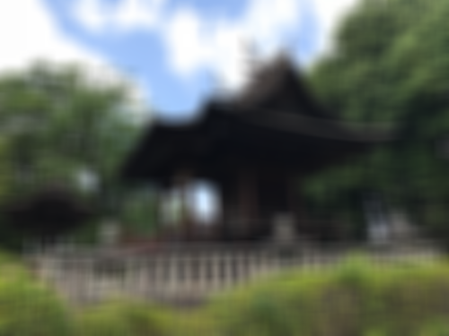
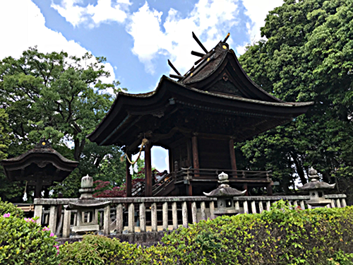

# Gaussian Blur and Sharpen

Project to blur and sharpen images using cuda and c++

## Building project

Ensure that you have c++, nvcc and cuda libraries installed.

Make the project using make

```bash
make clean && make
```

## Using the Program

After creating the program, the executable `filter` will be created. This will allow you to apply one of a set of premade kernels to an image.

Here is the help message from the program

```
Usage: ./filter img_in.png img_out.png filter_type filter_size
    img_in.png - path to input image (png format)
    img_out.png - path to output image (png format)
    filter_type - type of filter to use, specified by int
        0 : no filter
        1 : box_blur            (uses filter_size)
        2 : gaussian_blur       (uses filter_size)
        3 : sharpen
        4 : Unsharp masking     (uses filter_size)
    filter_size - if a filter has a size parameter.
        This is the radius of the filter. A value of zero
        will result in a 1x1 filter, 2 in a 3x3 filter, etc...
```

Example usage
(applies a box blurring filter with a radius of size 3)
```
./filter img.png img_box_blur.png 1 3
```

The arguments are as follows:
* `img_in.png` path to the input image (png format)
* `img_out.png` path to the output image (png format)
* `filter_type` integer identifier for kernel type to use
* `filter_size` size of the filter if the filter uses ones

Here is a description of the different filters

| filter ID | filter name | configurable size | description |
|-----------|-------------|-------------------|-------------|
| 0 | identity | NO | Does nothing to the image |
| 1 | box_blur | YES | Applies a box blurring filter where each neighbor has an intensity of 1/(area of filter) |
| 2 | gaussian_blur | YES | Applys a gaussian blurring kernel where each neighbor is the gaussian distance from the kernel with a sigma value of kernel_radius/3 |
| 3 | sharpen | NO | Applys a sharpening kernel which follows the basic format of [[0, -1, 0][-1, 5, 1][0, -1, 0]] (where 5 is the center pixel) |
| 4 | Unsharpening mask | YES | Applays an [unsharpening mask](https://en.wikipedia.org/wiki/Unsharp_masking) to each pixel which is essentially a gaussian based sharpening kernel |

## Sample

|Filter|Size|Image|
|------|----|-----|
|Original| |  |
|Box Blur| 3x3 | |
|Box Blur| 21x21 | |
|Gaussian Blur| 21x21 | 
|Sharp | 3x3 |  |
|Unsharp mask | 21x21 |  |

## Sources

Example project code used from
[mdsravn/easyCuda](https://github.com/madsravn/easyCuda)

Functions and descriptions of kernel sharpening algorithms
[https://en.wikipedia.org/wiki/Kernel_(image_processing)](https://en.wikipedia.org/wiki/Kernel_(image_processing))

